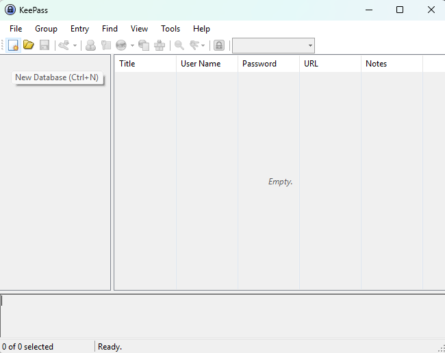
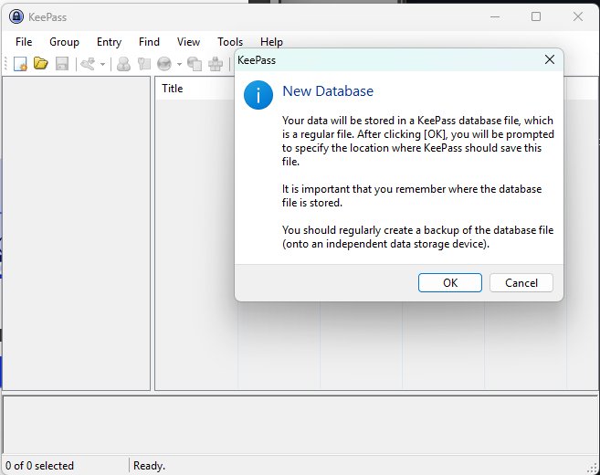
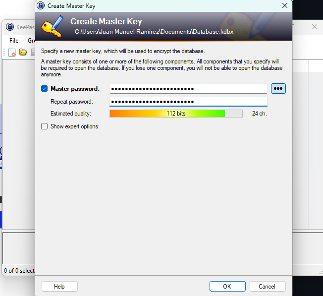
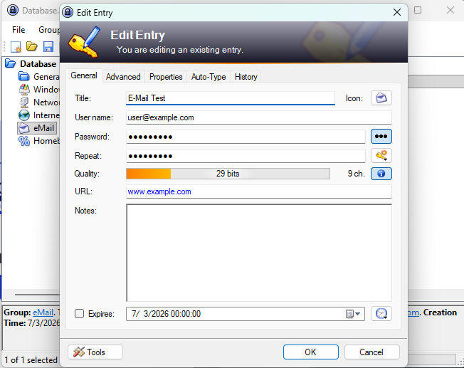
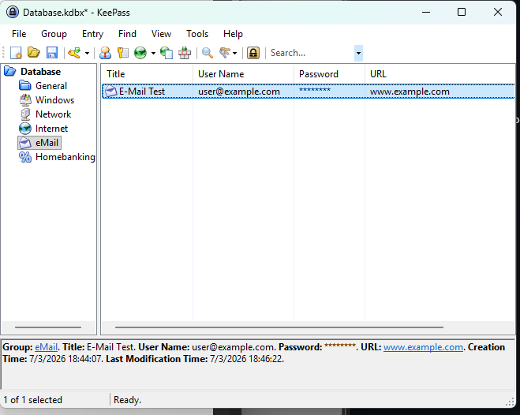

# Lab 01 – KeePass Password Manager

## Description

In this lab I used **KeePass** to create and manage a secure password database.

The objective was to understand how password managers store credentials securely using encryption.

---

## Lab Walkthrough

### Step 1 – Create KeePass Database

From the KeePass interface, select the option to **create a new password database**.

The application will then display a confirmation prompt indicating that a new encrypted database will be created.

---

### Step 2 – Configure Master Password

A strong master password was configured to protect the database.

---

### Step 3 – Create and Edit a New Entry

Create a new credential entry and fill in the required fields such as username, password, and notes.

---

### Step 4 – Resulting Password Database

The database now contains the stored credentials which can be accessed securely using the master password.

---

## Actions Performed

1. Created a local KeePass database.
2. Configured a master password.
3. Added several test credential entries.
4. Verified access to stored credentials after reopening the database.

---

## Example Entries

| Service         | Username                                    |
| --------------- | ------------------------------------------- |
| Email Test      | user@example.com |
| Web Account     | test_user                                   |
| Internal System | admin_test                                  |

---

## Key Takeaways

* Password managers allow secure storage of multiple credentials.
* A strong master password protects the entire database.
* Using a password manager helps prevent password reuse.

---

## Status

Completed

---

## Tools Used

- KeePass
