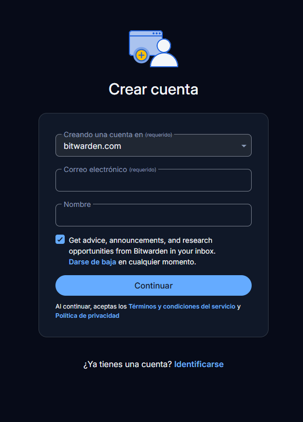
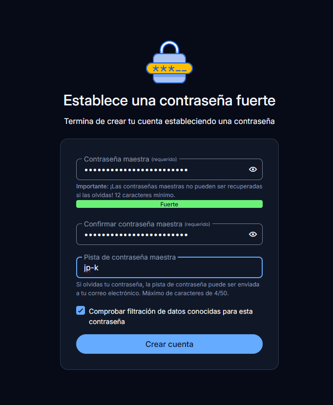
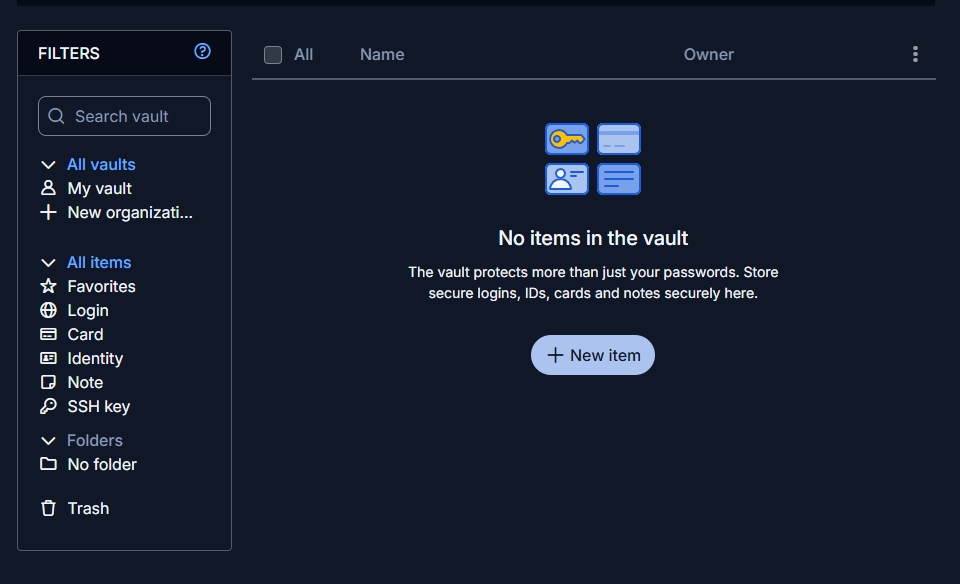
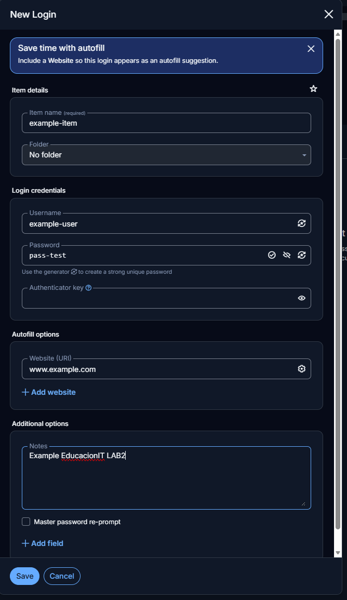
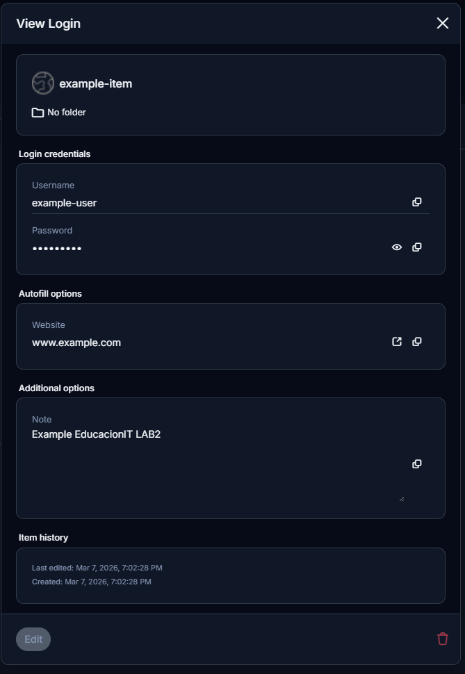
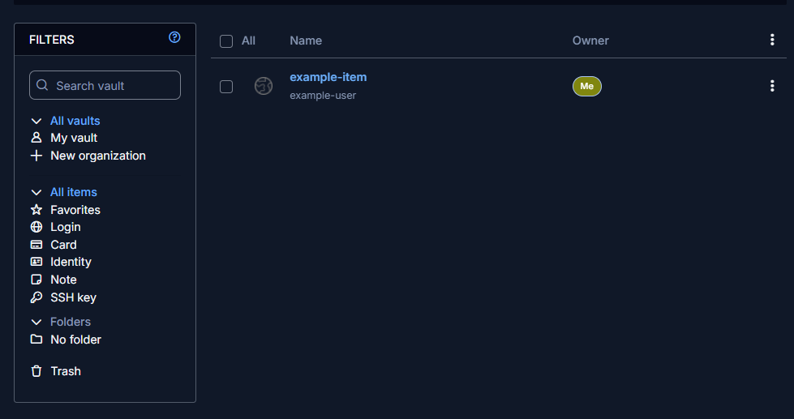

# Lab 02 – Bitwarden Password Manager

## Description

In this lab I used Bitwarden to create and manage a cloud-based password vault.  
The objective was to understand how password managers securely store credentials and synchronize them across multiple devices.

---

# Lab Steps

## Step 1 – Create a Bitwarden Account

First, a new account was created in Bitwarden using an email address and master password.

---

## Step 2 – Create a Strong Master Password

A strong master password was generated to secure the vault.  
This password protects access to all stored credentials.

---

## Step 3 – Access the Bitwarden Vault Interface

After logging in, the Bitwarden Web Vault dashboard was displayed.  
From here new credential entries can be created using the **+ New Item** button.

---

## Step 4 – Create a New Login Item

A new login entry was created to store test credentials.

---

## Step 5 – Review the New Credential Entry

The system displays a summary of the newly created credential before saving it to the vault.

---

## Step 6 – Confirm Item Stored in the Vault

The new credential entry appears in the vault list after creation.

---

## Example Entries

| Service | Username |
|--------|--------|
| Email Test | user@example.com |
| Web Account | test_user |
| Internal System | admin_test |

---

## Key Takeaways

* Cloud password managers allow secure credential storage across multiple devices.
* Password vault synchronization enables access from desktop and mobile environments.
* Using a password manager reduces password reuse and improves credential security.

---

## Tools Used

- Bitwarden (Web Vault)
- Bitwarden Browser Extension
- Bitwarden Mobile App

---

## Status

 - Completed

## Tools Used

 - Bitwarden
